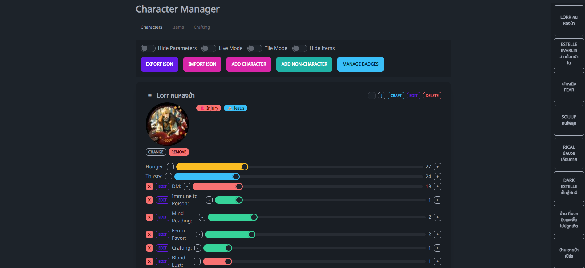

# Character Manager

A web-based character management system built with HTML, CSS (TailwindCSS + DaisyUI), and vanilla JavaScript. Perfect for tabletop RPGs, storytelling, game development, or any scenario where you need to track multiple characters with custom attributes and inventories.



## 🌟 Features

### Core Functionality
- **Character Management**: Create, edit, and delete characters or non-character entities
- **Multilingual Support**: Built-in support for Thai and other non-English characters using Noto Sans Thai font
- **Avatar System**: Upload and manage character avatars with automatic compression
- **Inventory System**: Add, edit, move, and track items with quantities
- **Custom Parameters**: Create custom attributes with range sliders or checkboxes
- **Badge System**: Dynamic badges with conditional logic based on character stats
- **Data Persistence**: Automatic saving to browser localStorage
- **Import/Export**: JSON-based data backup and sharing

### User Interface Features
- **Multiple View Modes**:
  - Standard card view
  - Tile mode for compact display
  - Live mode for real-time updates
- **Toggle Controls**:
  - Hide/show parameters
  - Hide/show items
  - Hide/show buttons (Live Mode)
- **Drag & Drop**: Reorder characters with intuitive drag-and-drop
- **Responsive Design**: Works on desktop and mobile devices
- **Dark Theme**: Modern dark theme with DaisyUI components

### Advanced Features
- **Smart Suggestions**: Auto-complete for items and parameters based on existing data
- **Item Management**: Move items between characters with quantity control
- **Statistics Summary**: Real-time summary of characters, items, and parameters
- **Character Navigation**: Floating menu for quick character navigation
- **Real-time Updates**: Live mode with automatic data synchronization

## 🚀 Getting Started

### Prerequisites
- Modern web browser with JavaScript enabled
- No server setup required - runs entirely in the browser

### Installation
1. Download the `characterNoto.html` file
2. Open it in your web browser
3. Start creating characters!

### Quick Start
1. **Add Your First Character**:
   - Click "Add Character" to create a character with default hunger/thirsty stats
   - Or click "Add Non-Character" for entities without default stats

2. **Customize Your Character**:
   - Upload an avatar by clicking "Change" under the character image
   - Add custom parameters using "Add Custom Parameter"
   - Add items to the character's inventory

3. **Create Badges** (Optional):
   - Click "Manage Badges" to create conditional badges
   - Set up conditions using JavaScript expressions

## 📖 User Guide

### Character Types

#### Standard Characters
- Come with default `hunger` and `thirsty` attributes (0-100 range)
- Perfect for RPG characters or living entities

#### Non-Characters
- No default attributes
- Ideal for locations, organizations, or inanimate objects

### Managing Attributes

#### Default Attributes
- **Hunger**: 0-100 range with warning color theme
- **Thirsty**: 0-100 range with info color theme
- Use +/- buttons or drag the slider to adjust values

#### Custom Parameters
Two types available:

1. **Range Parameters**:
   - Configurable min/max values
   - Color-coded themes
   - +/- adjustment buttons
   
2. **Checkbox Parameters**:
   - Simple true/false toggles
   - Color-coded themes

### Inventory Management

#### Adding Items
- Click "Add Item" on any character
- Enter item name and quantity
- Auto-complete suggests existing items

#### Moving Items
- Click "Move" next to any item
- Select destination character
- Specify quantity to move
- Items automatically merge if they already exist in destination

#### Editing Items
- Click on item name to edit inline
- Adjust quantity with number input
- Delete items with the X button

### Badge System

#### Creating Badges
1. Click "Manage Badges"
2. Fill in badge details:
   - **Name**: Display name for the badge
   - **Icon**: Emoji icon (use Win+; on Windows)
   - **Color**: Theme color (primary, secondary, accent, etc.)
   - **Description**: Tooltip text
   - **Condition**: JavaScript expression for when to show

#### Badge Conditions
Use JavaScript expressions with access to character properties:

```javascript
// Examples:
hunger > 50                           // Show when hunger > 50
thirsty < 20 && hunger > 80          // Show when very thirsty but well-fed
custom['Health'].value === true      // Show when custom Health checkbox is true
custom['Level'].value >= 10          // Show when custom Level parameter >= 10
```

Available properties:
- `hunger` - Character hunger level (0-100)
- `thirsty` - Character thirst level (0-100)
- `custom['paramName'].value` - Custom parameter value
- `custom['paramName'].type` - Parameter type ('range' or 'checkbox')
- `custom['paramName'].min` - Range parameter minimum
- `custom['paramName'].max` - Range parameter maximum

### View Modes

#### Standard Mode
- Full character cards with all information
- Best for detailed character management

#### Tile Mode
- Compact grid layout
- Wider cards (400px minimum)
- Better for overview of many characters

#### Live Mode
- Disables all editing controls
- Polls localStorage for updates every second
- Perfect for display screens or when multiple people are viewing

### Data Management

#### Auto-Save
- All changes automatically save to browser localStorage
- Green toast notification confirms saves
- Data persists between browser sessions

#### Export Data
- Click "Export JSON" to download complete dataset
- Includes all characters, items, parameters, and badges
- Use for backups or sharing with others

#### Import Data
- Click "Import JSON" to load data from file
- Completely replaces current data
- Supports both character-only and full dataset formats

### Navigation

#### Character Menu
- Floating menu on the right side
- Quick navigation to any character
- Automatically updates as characters are added/removed

#### Character Ordering
- Drag characters by the ☰ handle
- Use ↑/↓ buttons for precise movement
- Order is preserved in data exports

## 🛠️ Technical Details

### Technologies Used
- **HTML5**: Semantic markup with modern standards
- **CSS**: Custom styles with responsive design
- **TailwindCSS**: Utility-first CSS framework
- **DaisyUI**: Component library for consistent UI
- **Vanilla JavaScript**: No external JavaScript dependencies
- **SortableJS**: Drag-and-drop functionality (CDN)
- **Google Fonts**: Noto Sans Thai for multilingual support

### Browser Compatibility
- Chrome 70+
- Firefox 65+
- Safari 12+
- Edge 79+

### Performance
- Lightweight single-file architecture
- Efficient localStorage operations
- Optimized rendering for large character lists
- Automatic image compression for avatars

### Data Structure

#### Character Object
```javascript
{
  name: "Character Name",           // Required
  hunger: 50,                      // 0-100, optional
  thirsty: 50,                     // 0-100, optional
  avatar: "data:image/jpeg;base64...", // Base64 image data, optional
  items: [                         // Array of items
    { name: "Item Name", amount: 5 }
  ],
  custom: {                        // Custom parameters
    "paramName": {
      type: "range",               // "range" or "checkbox"
      min: 0,                      // Range min value
      max: 100,                    // Range max value
      value: 50,                   // Current value
      color: "primary"             // Theme color
    }
  }
}
```

#### Badge Object
```javascript
{
  name: "Badge Name",              // Display name
  icon: "🏆",                      // Emoji icon
  color: "primary",                // Theme color
  desc: "Description text",        // Tooltip description
  cond: "hunger > 50"              // JavaScript condition
}
```

### Storage Format
Data is stored in browser localStorage as JSON:
- `characterData`: Array of character objects
- `badgeData`: Array of badge objects

## 🎮 Use Cases

### Tabletop RPGs
- Track player characters and NPCs
- Manage character inventories
- Monitor health, mana, or custom stats
- Create status effect badges

### Game Development
- Character database for testing
- NPC management during development
- Item balancing and tracking
- Character progression visualization

### Storytelling
- Character development tracking
- Relationship and status management
- World-building entity organization
- Plot device inventory

### Education
- Student progress tracking
- Resource management exercises
- Character analysis for literature
- Interactive learning scenarios

## 🔧 Customization

### Themes
The application uses DaisyUI themes. You can modify the theme by changing the `data-theme` attribute in the HTML tag:

```html
<html lang="en" data-theme="light">  <!-- For light theme -->
<html lang="en" data-theme="dark">   <!-- For dark theme -->
```

### Colors
Available color themes for parameters and badges:
- `primary` (blue)
- `secondary` (purple)
- `accent` (pink)
- `info` (cyan)
- `success` (green)
- `warning` (yellow)
- `error` (red)

### Adding New Features
The modular JavaScript structure makes it easy to add new features:

1. **New Parameter Types**: Extend the `renderCharacters()` function
2. **Additional Badge Conditions**: Modify badge evaluation logic
3. **Custom Export Formats**: Extend the `exportData()` function
4. **New View Modes**: Add CSS classes and toggle logic

## 📱 Mobile Optimization

The application is fully responsive and optimized for mobile devices:
- Touch-friendly buttons and controls
- Responsive grid layouts
- Mobile-optimized modals
- Swipe-friendly navigation

## 🔒 Privacy & Security

- **Local Storage Only**: All data stays in your browser
- **No Server Communication**: Completely offline after initial load
- **No Analytics**: No tracking or data collection
- **Secure by Design**: No external data transmission

## 🐛 Troubleshooting

### Common Issues

#### Data Not Saving
- Check if localStorage is enabled in your browser
- Ensure you're not in private/incognito mode
- Clear browser cache and reload

#### Images Not Loading
- Ensure image files are under 5MB
- Supported formats: JPG, PNG, GIF, WebP
- Try refreshing the page after upload

#### Badges Not Showing
- Check JavaScript console for condition errors
- Ensure badge conditions use valid syntax
- Verify custom parameter names match exactly

#### Performance Issues
- Limit characters to under 100 for optimal performance
- Compress large images before upload
- Clear browser cache periodically

### Browser Console
Open developer tools (F12) to see detailed error messages and debug information.

## 📄 License

This project is open source and available under the MIT License.

## 🤝 Contributing

Contributions are welcome! Please feel free to submit issues, feature requests, or pull requests.

### Development Setup
1. Clone the repository
2. Open `characterNoto.html` in your browser
3. Make changes and test locally
4. Submit pull request

### Coding Standards
- Use vanilla JavaScript (no frameworks)
- Follow existing code style
- Add comments for complex logic
- Test on multiple browsers

## 📞 Support

If you encounter issues or have questions:
1. Check the troubleshooting section
2. Open an issue on GitHub
3. Provide detailed error information and browser version

## 🗺️ Roadmap

### Planned Features
- [ ] Multi-language interface
- [ ] Advanced badge conditions
- [ ] Character templates
- [ ] Bulk operations
- [ ] Data validation
- [ ] Export to different formats (CSV, XML)
- [ ] Character relationships/connections
- [ ] Advanced statistics and charts

### Completed Features
- [x] Basic character management
- [x] Avatar system
- [x] Custom parameters
- [x] Badge system
- [x] Import/export functionality
- [x] Drag and drop reordering
- [x] Mobile optimization
- [x] Live mode
- [x] Item management
- [x] Auto-suggestions

---

**Created with ❤️ for character management enthusiasts**
