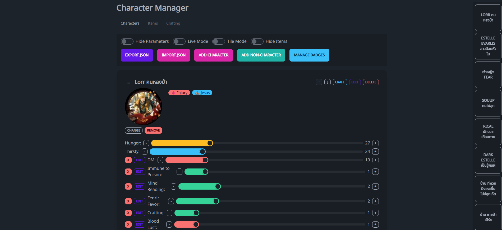

# Character Manager (CharacterNoto)

A browser-based manager for tabletop RPGs / storytelling / game prototyping: characters, items, crafting, a region-loot **map**, a multi-axis **relationship graph**, real **3D dice**, and live **read-only sharing** from a DM to players over peer-to-peer.

Runs entirely in your browser — data stays local (localStorage + IndexedDB). Originally a single-file vanilla app; **v3.x** is a rewrite on **Svelte 5 + Vite**. The legacy single-file version is kept under [`legacy/`](legacy/).



## Features

- **Characters** — create characters / non-characters, hunger & thirsty stats, custom range/checkbox parameters, avatars (stored in IndexedDB), inventories (add/move/use), and **badges** with conditional logic. Tile mode, hide-params/items toggles, drag-reorder.
- **Items** — an item encyclopedia with an **effects engine** (add/subtract/set on stats or custom params); use an item on a character; search.
- **Crafting** — recipes (materials → outputs), live preview, max-craftable, craft straight from a character card.
- **Map** — upload a background image, draw freeform **polygon regions**, edit/reshape them, and stock each region with a **loot table** (per-item drop %, per-roll quantity, depleting stock or infinite). **Roll** independent or weighted; send loot to a character's inventory.
- **Relationships** — a character graph with **DM-defined axes** (e.g. Trust/Fear/Respect, each its own min/max). Rate each directed relationship and view it as an SVG **radar/spider chart** (with the reverse edge overlaid); highlight graph edges by an axis.
- **Dice** — a **3D dice** builder (Three.js + cannon-es): any number of dice, any number of faces, custom label per face, dice can differ; physics tumble then reveals a fair result. Plus a classic notation roller (`2d6+3`).
- **Sharing (DM → players)** — go live and share a **read-only** view with players over **WebRTC P2P** (PeerJS) — no server, no account. Pick which tabs to share; hidden entities/unshared tabs are filtered out at the source. See [Sharing](#sharing-dm--players).
- **Themes** — 10 DaisyUI themes; **zip backup** (export/import incl. images).

## Run

Requires Node 18+.

```bash
npm install
npm run dev      # http://localhost:5173
npm run build    # static build → dist/ (host anywhere, e.g. GitHub Pages)
npm run preview  # preview the build
```

There is no backend — `dist/` is fully static.

## Sharing (DM → players)

1. The host (DM) clicks **Share → Go Live**. A **room code** and a **viewer link** (`?view=1&room=…`) are generated.
2. Players open the link (or open `?view=1` and type the room code) → they connect **directly** to the DM over WebRTC and watch **read-only**, live.
3. The DM toggles which tabs are shared; changes re-broadcast instantly. Only shared tabs (minus any entity flagged hidden) are ever sent.

How it finds the host: the room code **is** the DM's PeerJS peer id. A free public **broker** (PeerJS) only brokers the handshake — game data flows browser-to-browser, never through it. Uses public STUN (no TURN), so it works on typical home/mobile networks; strict/corporate NAT may block P2P. The DM must stay online for players to connect.

## Data & privacy

- All data is local: JSON in **localStorage**, images (avatars, map backgrounds) as Blobs in **IndexedDB**.
- No server, no analytics. Sharing is peer-to-peer; players receive only what the DM shares.
- Full-fidelity **zip backup** bundles a JSON manifest + images.

## Tech

Svelte 5 · Vite · Tailwind CSS 3 + DaisyUI 4 · Three.js + cannon-es (3D dice) · PeerJS (P2P sharing) · JSZip (backup) · Noto Sans Thai.

Pure logic has node self-checks: `node src/lib/<name>.test.mjs` (effects/crafting, loot, dice, dice-set, public-view).

## License

MIT.
